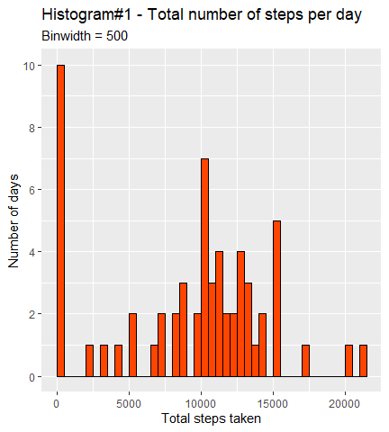
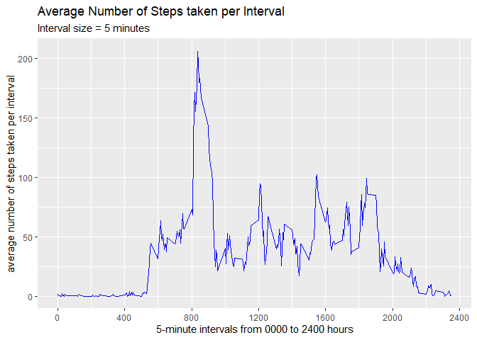
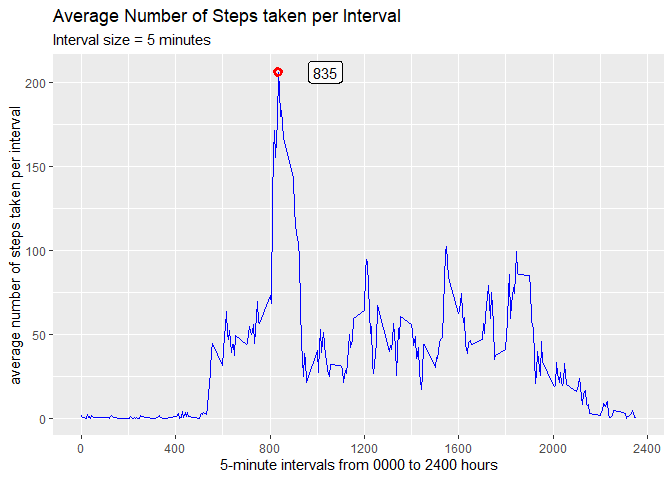
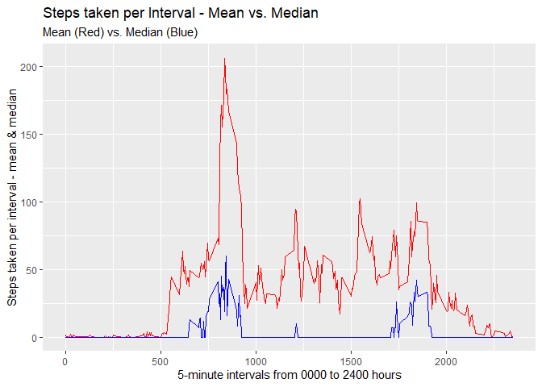
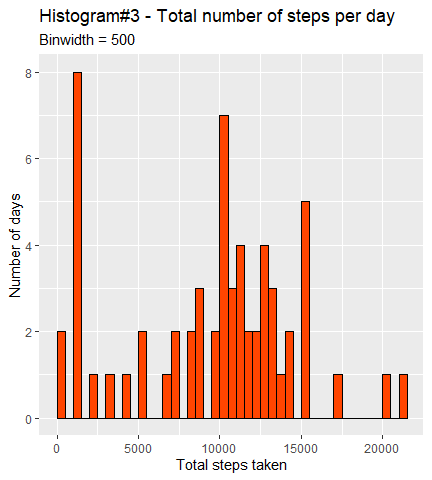
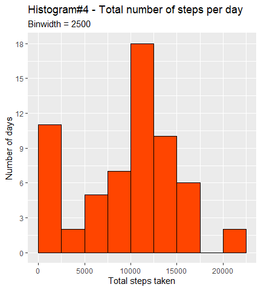
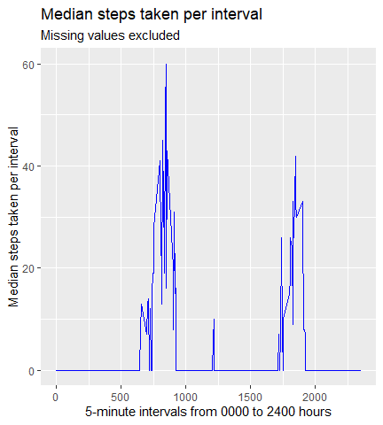
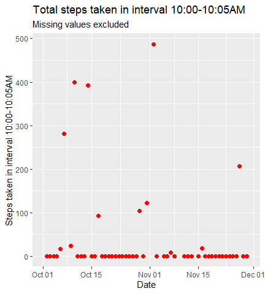
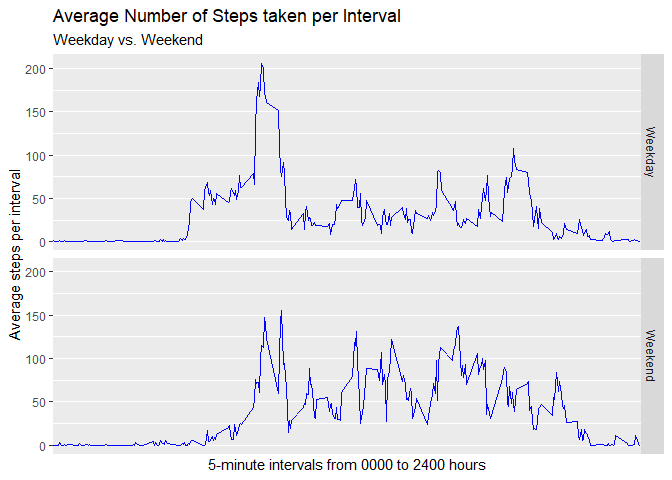

## Introduction To The Assignment[^1]

It is now possible to collect a large amount of data about personal movement using activity monitoring devices such as a Fitbit, Nike Fuelband, or Jawbone Up. These type of devices are part of the "*quantified self*" movement – a group of enthusiasts who take measurements about themselves regularly to improve their health, to find patterns in their behavior, or because they are tech geeks. But these data remain under-utilized both because the raw data are hard to obtain and there is a lack of statistical methods and software for processing and interpreting the data.

This assignment makes use of data from a personal activity monitoring device. This device collects data at 5 minute intervals through out the day. The data consists of two months of data from an anonymous individual collected during the months of October and November, 2012 and include the number of steps taken in 5 minute intervals each day.
The data for this assignment can be downloaded from the course web site:

*    Dataset: [Activity Monitoring Data](https://d396qusza40orc.cloudfront.net/repdata%2Fdata%2Factivity.zip)

The variables included in this dataset are:

*    **steps**: Number of steps taking in a 5-minute interval (missing values are coded as NA)
*    **date**: The date on which the measurement was taken in YYYY-MM-DD format
*    **interval**: Identifier for the 5-minute interval in which measurement was taken

The dataset is stored in a comma-separated-value (CSV) file and there are a total of 17,568 observations in this dataset.

***  

## Objective Of The Assignment[^2]

The objective of the assignment is to write up a report based on the **Activity Monitoring Data**, that answers the below questions:

1.    Code for reading in the dataset and/or processing the data
2.    Histogram of the total number of steps taken each day
3.    Mean and median number of steps taken each day
4.    Time series plot of the average number of steps taken
5.    The 5-minute interval that, on average, contains the maximum number of steps
6.    Code to describe and show a strategy for imputing missing data
7.    Histogram of the total number of steps taken each day after missing values are imputed
8.    Panel plot comparing the average number of steps taken per 5-minute interval across weekdays and weekends
9.    All of the R code needed to reproduce the results (numbers, plots, etc.) in the report

The entire assignment will be completed in this R Markdown document, and the submission will be pushed into this [Githib respository](https://github.com/siddhuorama/RepData_PeerAssessment1).

***  

## Methodology

1. The report contains a combination of text, code, and presentation material (plots and tables)
2. The code for creating presentation material is provided in Section 9 of the report. All other code is provided wherever it is actually run
3. The report is designed to be accessible to both experts and lay-persons. To that end, I have used simple language, and explained my observations and methods extensively
4. At the end of the report, I have gone beyond the remit of this report, and tried to imagine an average day in the life of the person who used the activity monitoring device

***  

## The Report
  
  
### 1. Reading In The Activity Monitoring Data:

Prior to reading in the data, we load the following packages:

*    **tidyverse**: Contains a set of packages for working with raw and processed datasets (ex. dplyr, tidyr, tibble, ggplot2)
*    **stringr**: Useful package for working with strings
*    **lubridate**: Indispensable package for working with dates and times


```r
###Installing and Loading the "tidyverse" set of packages, plus "stringr", and "lubridate" packages

#install.packages("tidyverse") #Remove "#" if not already installed
library(tidyverse)
#install.packages("stringr") #Remove "#" if not already installed
library(stringr)
#install.packages("lubridate") #Remove "#" if not already installed
library(lubridate)
```
  
We download the URL, which downloads a zip file. We unzip it in our working directory. The dataset is in a CSV file - "activity.csv".


```r
#Downloading the zip file and unzipping the contents in my working directory
URL <- "https://d396qusza40orc.cloudfront.net/repdata%2Fdata%2Factivity.zip"
download.file(URL, destfile = "Repdata_Activity.zip")
unzip("Repdata_Activity.zip", files = NULL, list = FALSE, overwrite = TRUE,
      junkpaths = FALSE, exdir = ".", unzip = "internal",
      setTimes = FALSE)
```
  
Next, we read in the data using the _read_csv()_ function from the *readr* package. We save it as a data frame named **activityData**.


```r
#Read the CSV file "activity.csv"
activityData <- read_csv("activity.csv", n_max = 20000)
```
  
**activityData** consists of 3 variables, the details of which are enumerated in the *Introduction To The Assignment* section above. Here is a look at 10 randomly generated rows from the dataset:


 steps       date       interval 
-------  ------------  ----------
   7      2012-11-13      920    
   0      2012-11-18      1210   
  50      2012-10-23      1400   
  46      2012-10-11      1130   
  52      2012-10-14       25    
  NA      2012-11-30      1300   
   0      2012-11-16      1115   
  NA      2012-10-01      755    
   0      2012-11-26      150    
   0      2012-11-23       30    

***  
  
### 2. Histogram Of The Total Number Of Steps Taken Each Day

Before generating a histogram of the total number of steps taken per day, we need to modify the original dataset. We create a new dataset, **activityDataHistogram**, which groups the observations in **activityData** by date, and creates a new variable "total_steps". This variable shows the total number of steps recorded on each date.  


```r
activityDataHistogram <- activityData %>%
        group_by(date) %>%
        summarise(total_steps  = sum(steps, na.rm = TRUE))
```

The below table displays the first few rows of **activityDataHistogram**.  


    date       total_steps 
------------  -------------
 2012-10-01         0      
 2012-10-02        126     
 2012-10-03       11352    
 2012-10-04       12116    
 2012-10-05       13294    
 2012-10-06       15420    
 2012-10-07       11015    
 2012-10-08         0      
 2012-10-09       12811    
 2012-10-10       9900     
  
Now, we move on to generating our histogram. In an effort to understand the data better, I've plotted 2 histograms.  

**Histogram 1** plots for a binwidth of 500 steps each (0-499, 500-999, etc.). For example, the device recorded 0 steps for the date "2012-10-01" (refer to the table above). This entry will be entered in the 0-499 bin in our histogram. Similarly, the entry for "2012-10-03" (11352) will be entered in the 11000-11499 bin.

**Histogram 2** plots for a binwidth of 2500 steps each.

<!-- --><!-- -->

**Observations**:  

1.    A lot of the data is bunched around the midpoint of the plot (for both histograms)
2.    Both histograms approximate a normal (bell-shaped) distribution, apart from the 10+ observations in the leftmost bin (0-499 in Histogram 1, 0-2499 in Histogram 2)

Let's look at the 10 values with the least total steps to gain a better understanding of our data.


    date       total_steps 
------------  -------------
 2012-10-01         0      
 2012-10-08         0      
 2012-11-01         0      
 2012-11-04         0      
 2012-11-09         0      
 2012-11-10         0      
 2012-11-14         0      
 2012-11-30         0      
 2012-11-15        41      
 2012-10-02        126     
  
There are 8 days with 0 total steps recorded. It is highly improbable that the person wearing this device (let's call this person "**X**" for convenience) did not move at all for 24 hours. It is likely that the device did not record any of the steps taken by X on these 8 days, possibly because it was either turned off, or malfunctioning.  
  
***  

### 3. Mean And Median Number Of Steps Taken Each Day

In order to compute the mean and median steps taken each day, we create a summary table from the **activityDataHistogram** dataset. We name it **activityDataHistSummary**. 


```r
activityDataHistSummary <- activityDataHistogram %>%
        summarize(mean_steps = round(mean(total_steps, na.rm = TRUE),0),
                  median_steps = median(total_steps, na.rm = TRUE))
```

The mean and median values are summarised in the table below.  


 mean steps    median steps 
------------  --------------
    9354          10395     

***  
  
### 4. Time Series Plot Of The Average Number Of Steps Taken

A time series plot for the average number of steps taken per interval will help us map which time periods saw high and low activity. We create a new dataset, **activityDataTS**, from our original dataset (**activityData**), and use it to plot our time series graph.


```r
activityDataTS <- activityData %>%
        group_by(interval) %>%
        summarise(avg_steps = mean(steps, na.rm = TRUE))
```
  



**Observations**:  

1.    There are very few steps from midnight to approximately 5:30AM. This indicates that X is sleeping during that time
2.    There is a steady increase in steps from 6:00AM till 8:00AM, post which there is a steep increase in the number of steps. A high level of steps (> 100/interval) is maintained for close to an hour (approx. 8:30-9:30AM) , followed by a steep drop. Possibly, X is exercising 
3.    There is continuous low-level activity from 10:00AM to 8:00PM, after which the number of steps slowly peter down to 0

***  

### 5. The 5-Minute Interval With The Maximum Average Number Of Steps

We will show the 5-minute interval with the maximum number of steps (on average) by labelling it on the same time-series plot we created above. However, we need to filter out the interval with the maximum steps first. We use the code below to do so.


```r
activityDataTSMax <- activityDataTS %>%
        filter(avg_steps == max(avg_steps))
```

The modified plot is shown below.  



The interval labelled in the plot is **835**. This means that the 5-minute interval with the maximum number of steps (on average) is **8:35-8:40 AM**. 

We can also show both the interval and the maximum number of steps as a table:


 5-minute Interval    Average Number of Steps 
-------------------  -------------------------
        835                  206.1698         

***  

### 6. Code To Describe And Show A Strategy To Impute Missing Data

We need to answer 2 questions in order to figure out what strategy to use for imputing missing data:  

1.    Which measure should we use to  fill in missing values?
2.    Should we use a measure that approximates for the day, or the interval? (Ex. If, say, we have a missing value for the interval "930" for the day "2012-11-05", and our measure is the mean, should we use the mean of all "930" intervals, or should we use the mean of all intervals in the day "2012-11-05"?)

Let's answer the second question first.

**Should we use a measure that approximates for the day, or the interval?**

Applying a basic count summary on our original dataset, **activityData**, tells us that the data is missing entirely (for all *24 x 12 = 288* intervals) for 8 days, and on no other days. 


```r
activityDataCount <- activityData %>%
  filter(is.na(steps)) %>%
  count(date)
```

The above observation can be shown in the below table.  


    Date       No. of Intervals with Missing Values 
------------  --------------------------------------
 2012-10-01                    288                  
 2012-10-08                    288                  
 2012-11-01                    288                  
 2012-11-04                    288                  
 2012-11-09                    288                  
 2012-11-10                    288                  
 2012-11-14                    288                  
 2012-11-30                    288                  

Thus, *we should use a measure that approximates for the interval*.

**Which measure should we use to  fill in missing values?**  
  
>"When describing a distribution, you can easily calculate the mode, the median, and the mean, but which one should you report, if you were to report just one? It depends. What you need to remember is that the mean is very sensitive to extreme values, while the median is not. The median is a **resistant statistic**." - Alberto Cairo, The Truthful Art[^3]


Basically, the mean is sensitive to extreme values, but the median isn't. Let's plot a time-series graph for both the median and the mean of every 5-minute interval to check if the mean is skewed.



There is a significant difference in the mean and median values for most intervals, indicating that the mean is indeed skewed. Thus, _we will use the **median** as our measure for imputing missing values_.  

**Imputing missing values based on our strategy, to create a new dataset**:  

We create a new dataset by imputing the median of each 5-minute interval into the relevant observations. We do this by splitting up the original dataset based on "NA" and non-"NA" values, adding the median values into the "NA" dataset using the _cbind()_ function, and then using the _rbind()_ function to stitch up the "NA" and non-"NA" datasets into our updated dataset, **activityDataUpdated**. The code for the procedure is shared below:   


```r
#Create a new dataset for "NA" values of variable "steps" from activityData
#Remove the "steps" variable from the new dataset
activityDataNA <- activityData %>%
        filter(is.na(steps)) %>%
        select(date, interval)

#Create a new dataset for non-"NA" values of variable "steps" from activityData
activityDataFine <- activityData %>%
        filter(!is.na(steps))

#Summarize median values of variable "steps" for each interval
#Select only the "steps" variable from the new dataset
activityDataIntervalMedian <- activityData %>%
        group_by(interval) %>%
        summarize(steps = median(steps, na.rm = TRUE)) %>%
        select(steps)

#Column-bind the activityDataIntervalMedian and activityDataNA datasets into the activityDataNA dataset
activityDataNA <- cbind(activityDataIntervalMedian, activityDataNA)

#Create new dataset activityDataUpdated by binding the rows of activityDataNA and activityDataFine datasets. Arrange by date
activityDataUpdated <- rbind(activityDataNA, activityDataFine) %>%
        arrange(date)
```
***  

### 7. Histogram Of The Total Number Of Steps Taken Each Day After Missing Values Are Imputed

We will recreate the same histogram plots that we created in part 2 of the assignment. The first histogram plots for a binwidth of 500 steps each. The second one plots for a binwidth of 2500 steps each.

<!-- --><!-- -->

**Observations**:  

1.    The first histogram (**Histogram 3**) changes a little bit, as the 8 days for which we imputed missing values move from the 0-499 bin to the 1000-1499 bin. The histogram still doesn't completely resemble a normal distribution; there are lots of outlier values to the left of the distribution.
2.    The second histogram (**Histogram 4**) stays the same, as all the days for which we imputed missing values stay in the 0-2499 binwidth.

The reason that both histograms do not change much is because X does not take any steps for the majority of 5-minute intervals. To visualise this, let's construct the following 2 plots:

*    A time-series plot of median steps taken per interval
*    A time-series plot of total steps taken in one interval over 60 days

<!-- --><!-- -->

The first plot tells us that for most intervals during the day, the median number of steps taken by X is 0. For the second plot, we take an interval (10:00-10:05AM) where the median steps are 0. When we look at the plot, we see why. For most days, X does not move in this interval. Hence, the median value is 0.

*Since we used the median values per 5-minute interval to fill in missing values, and since median values for the majority of intervals are 0, we do not see much of a change in the updated histogram plots.*  

**Updated Mean and Median values of the total steps taken each day**:  

In order to compute the mean and median steps taken each day, we create a summary table from the **activityDataUpdatedHist** dataset. We name it **activityDataUpdadtedHistSummary**. 


```r
activityDataUpdadtedHistSummary <- activityDataUpdatedHist %>%
        summarize(mean_steps = round(mean(total_steps, na.rm = TRUE),0),
                  median_steps = median(total_steps, na.rm = TRUE))
```

The mean and median values are summarised in the table below.  


 mean steps    median steps 
------------  --------------
    9504          10395     

The **mean value** is _**9504** for the updated data_, versus _**9354** for the data with missing values_. This is not surprising, as all the missing values were totted up to 0 in the original data. In the updated data, the median values for each interval replaced the missing values, thus bringing up the mean.

The **median value** stays the same (**10395**), as all the missing values in the original dataset are replaced by the median values for each interval.  


***  

### 8. Panel Plot Comparing The Average Number Of Steps Taken Per 5-minute Interval Across Weekdays And Weekends

Before we construct the panel plot, we need to add a variable to **activityDataUpdated** that indicates whether an observation was recorded on a weekday or a weekend. The code below enables us to do exactly that.


```r
#Add a "weekday" column to activityDataUpdated 
#This variable computes a number from 1 to 7 representing each day of the week
activityDataUpdated <- activityDataUpdated %>%
        mutate(weekday = wday(date))

#Split activityDataUpdated into 2 datasets based on whether the observation in the "weekday" variable represents a weekday or a weekend
#Add a column "week_part" that indicates whether the observation in "weekday" indicates a weekday or a weekend
activityDataUpdatedWork <- activityDataUpdated %>%
        filter(weekday %in% c(2,3,4,5,6)) %>%
        mutate(week_part = "Weekday")
activityDataUpdatedFun <- activityDataUpdated %>%
        filter(weekday %in% c(1,7)) %>%
        mutate(week_part = "Weekend")

#Use the rbind() funtion to combine the 2 datasets into activityDataUpdated
#Arrange the observations by date. We now have our original dataset with the "weekday" and "week_part" variables added.
activityDataUpdated <- rbind(activityDataUpdatedWork, 
                             activityDataUpdatedFun) %>%
        arrange(date)
```

Once we have added the required variable to **activityDataUpdated**, we create a summary dataset by grouping the "interval" and "week_part" variables, and summarise the mean for each combination of the two variables. We then use the *facet_grid* function in the  **ggplot2** package to construct the "Weekday vs. Weekend" panel plot.


```r
activityDataUpdatedWeek <- activityDataUpdated %>%
        group_by(interval, week_part) %>%
        summarise(avg_steps = mean(steps, na.rm = TRUE))
```




**Observations**:  

1.    There is more sustained activity throughout the day on weekends.
2.    However, on average, X is most active between 8:30AM and 9:30AM on weekdays.
3.    X wakes up later on weekends, and goes off to sleep later as well.

***  

### 9. All Of The R Code Needed To Reproduce The Results In The Report

We will reproduce below the R code chunks used to produce plots, figures and tables in this document section-by-section.

We've used the **ggplot2** package for all our plots, and the knitr function **kable()** to generate tables.  

**SECTION 1: Table 1 - Randomly Generated Rows from the Dataset**:  

```r
knitr::kable(
activityData[sample(1:nrow(activityData), 10, replace = FALSE),],
align = "ccc"
)
```
  
  
**SECTION 2: Table 2 - First few rows of Dataset used to create Histogram 1 & 2**:  

```r
knitr::kable(
        activityDataHistogram[1:10,],
        align = "cc"
)
```
  
  
**SECTION 2: Histogram 1 & 2 - Number of Steps Taken Per Day**:  

```r
ggplot(data = activityDataHistogram, mapping = aes(total_steps)) + 
  geom_histogram(colour = "black", fill = "orangered", 
                 binwidth = 500, boundary = 0) +
  labs(
    title = "Histogram#1 - Total number of steps per day",
    subtitle = "Binwidth = 500",
    x = "Total steps taken",
    y = "Number of days"
  ) +
  scale_y_continuous(n.breaks = 6)

ggplot(data = activityDataHistogram, mapping = aes(total_steps)) + 
        geom_histogram(colour = "black", fill = "orangered", 
                 binwidth = 2500, boundary = 0) +
        labs(title = "Histogram#2 - Total number of steps per day",
             subtitle = "Binwidth = 2500",
             x = "Total steps taken",
             y = "Number of days") +
        scale_y_continuous(breaks = seq(0, 18, by = 3))
```
  
  
**SECTION 2: Table 3 - 10 Days with the least total number of steps covered**:  

```r
activityDataHistModified <- activityDataHistogram %>%
        arrange(total_steps)

knitr::kable(
                activityDataHistModified[1:10,],
                align = "cc"
        )
```
  

**SECTION 3: Table 4 - Mean and Median number of steps taken each day**:  

```r
knitr::kable(
        activityDataHistSummary,
        align = "cc",
        col.names = c("Mean Number of Steps", "Median Number of Steps"))
```
  

**SECTION 4: Time Series Plot 1 - Average number of steps taken per interval**:  

```r
ggplot(data = activityDataTS, mapping = aes(interval, avg_steps)) + 
        geom_line(colour = "blue") +
        labs(
                title ="Average Number of Steps taken per Interval",
                subtitle = "Interval size = 5 minutes",
                x = "5-minute intervals from 0000 to 2400 hours",
                y = "average number of steps taken per interval"
        ) +
        scale_x_continuous(breaks = seq(0, 2400, by = 400))
```
  
  
**SECTION 5: Time Series Plot 2 - 5-minute Interval with maximum number of steps**:  

```r
ggplot(activityDataTS, mapping = aes(interval, avg_steps)) +
        geom_line(colour = "blue") +
        labs(
                title ="Average Number of Steps taken per Interval",
                subtitle = "Interval size = 5 minutes",
                x = "5-minute intervals from 0000 to 2400 hours",
                y = "average number of steps taken per interval"
        ) +
        scale_x_continuous(breaks = seq(0, 2400, by = 400)) +
        geom_point(data = activityDataTSMax, 
                   mapping = aes(interval, avg_steps), 
                   colour = "red", shape = 1, stroke = 2) +
        geom_label(data = activityDataTSMax, nudge_x = 200, alpha = 0.8,
                                  mapping = aes(label = interval))
```
  
  
**SECTION 5: Table 5 - 5-minute Interval with maximum number of steps per day**: 

```r
knitr::kable(
        activityDataTSMax,
        align = "cc",
        col.names = c("5-minute Interval", "Average Number of Steps")
)
```
  
  
**SECTION 6: Table 6 - Dates with missing values**:  

```r
knitr::kable(
  activityDataCount,
  align = "cc",
  col.names = c("Date", "No. of Intervals with Missing Values")
)
```
  

**SECTION 6: Time Series Plot 3 - Mean vs. Median values per 5-minute interval**:  

```r
activityData %>%
        group_by(interval) %>%
        summarise(mean_steps = mean(steps, na.rm = TRUE),
                  median_steps = median(steps, na.rm =  TRUE)) %>%
        ggplot() +
        geom_line(aes(interval, mean_steps), colour = "red") +
        geom_line(aes(interval, median_steps), colour = "blue") +
        labs(
                title ="Steps taken per Interval - Mean vs. Median",
                subtitle = "Mean (Red) vs. Median (Blue)",
                x = "5-minute intervals from 0000 to 2400 hours",
                y = "Steps taken per interval - mean & median"
        )
```


**SECTION 7: Histogram 3 & 4 - Number of steps taken each day (missing values imputed)**:  

```r
activityDataUpdatedHist <- activityDataUpdated %>%
        group_by(date) %>%
        summarise(total_steps  = sum(steps, na.rm = TRUE))

ggplot(data = activityDataUpdatedHist, mapping = aes(total_steps)) + 
  geom_histogram(colour = "black", fill = "orangered", 
                 binwidth = 500, boundary = 0) +
  labs(
    title = "Histogram#3 - Total number of steps per day",
    subtitle = "Binwidth = 500",
    x = "Total steps taken",
    y = "Number of days"
  ) +
  scale_y_continuous(n.breaks = 6)

ggplot(data = activityDataUpdatedHist, mapping = aes(total_steps)) + 
        geom_histogram(colour = "black", fill = "orangered", 
                 binwidth = 2500, boundary = 0) +
        labs(title = "Histogram#4 - Total number of steps per day",
             subtitle = "Binwidth = 2500",
             x = "Total steps taken",
             y = "Number of days") +
        scale_y_continuous(breaks = seq(0, 18, by = 3))
```
  

**SECTION 7: Time Series Plot 4 & 5 - Median Steps taken per interval + Total Steps taken in the interval 10:00-10:05AM**:

```r
activityData %>%
        group_by(interval) %>%
        summarise(median_steps = median(steps, na.rm =  TRUE)) %>%
        ggplot() +
        geom_line(aes(interval, median_steps), colour = "blue") +
        labs(
                title ="Median steps taken per interval",
                subtitle ="Missing values excluded",
                x = "5-minute intervals from 0000 to 2400 hours",
                y = "Median steps taken per interval"
        ) + 
        scale_y_continuous(breaks = seq(0 ,100 ,by = 20))

activityData %>% 
        filter(interval == 1000) %>%
        ggplot(aes(date, steps)) +
        geom_point(shape = 19, colour = "red", size = 2, na.rm = TRUE) +
        labs(
                title ="Total steps taken in interval 10:00-10:05AM",
                subtitle ="Missing values excluded",
                x = "Date",
                y = "Steps taken in interval 10:00-10:05AM"
        )
```
  

**SECTION 7: Table 7 - Mean and Median total steps taken per day**:

```r
knitr::kable(
        activityDataUpdadtedHistSummary,
        align = "cc",
        col.names = c("mean steps", "median steps"))
```

**SECTION 8: Panel Plot 1 - Average steps per interval across Weekdays and Weekends**:  

```r
ggplot(activityDataUpdatedWeek, mapping = aes(interval, avg_steps)) +
        geom_line(colour = "blue") +
        facet_grid(week_part ~ .) +
        labs(
                title ="Average Number of Steps taken per Interval",
                subtitle = "Weekday vs. Weekend",
                x = "5-minute intervals from 0000 to 2400 hours",
                y = "Average steps per interval"
        ) +
        scale_x_continuous(breaks = seq(0, 2400, by = 400))
```
  
***  

## Conclusion - An Imagined Day In The Life Of X:

Based on the information we have gathered over the making of this report, let's try to imagine an average day in the life of X. We only have the **Activity Monitoring Data** to go on, so I have made a lot of assumptions, and taken many leaps of faith. Here goes:

1. X usually wakes up between 5:30 and 6:00 on a typical weekday. On weekends, she stays in bed till 7:00.
2. On weekdays, X works out between 8:30 and 9:30. After a quick bath, she drives to work. At work, she works out of a cubicle, and only moves around occasionally. She goes to the office cafeteria for lunch at 12 noon. She is back home by 6, and she does a few chores, walks her pet golden retriever, and cooks herself a nice meal. She's in bed by 10. She reads for a bit, and falls asleep by 1. 
3. On weekends, X's schedule is more flexible. However, freed from the constraints of sitting in a cubicle all day, she is naturally more active. She has a more relaxed workout, and often goes out with her girlfriends. She sleeps in later than on weekdays.  

***  

## References:
[^1]: https://www.coursera.org/learn/reproducible-research/peer/gYyPt/course-project-1
[^2]: https://www.coursera.org/learn/reproducible-research/peer/gYyPt/course-project-1
[^3]: https://www.goodreads.com/book/show/26401716-the-truthful-art?ac=1&from_search=true&qid=EuUjqTqgx7&rank=1


